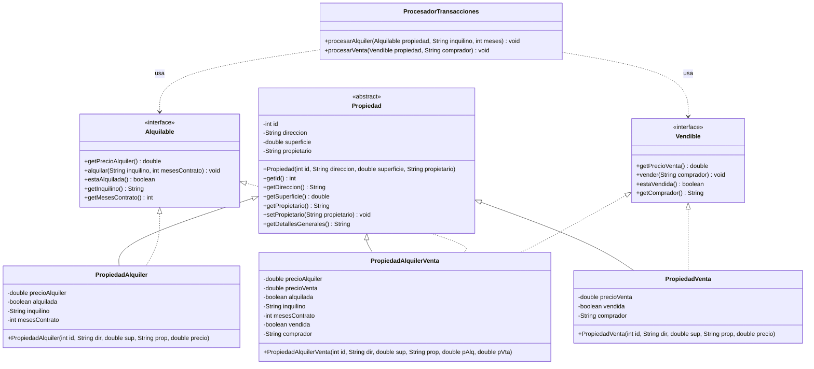
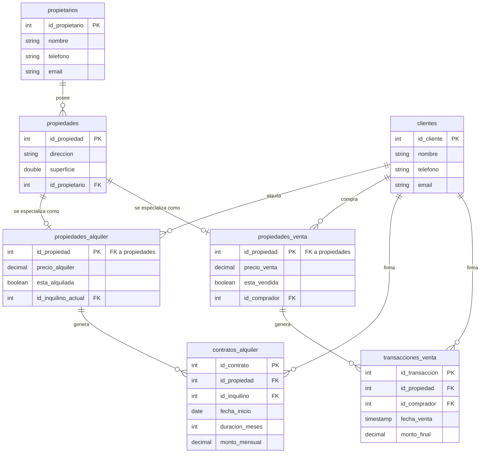
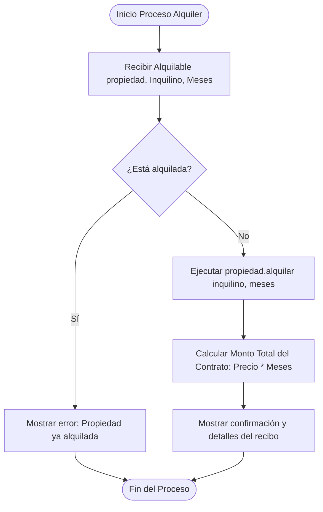
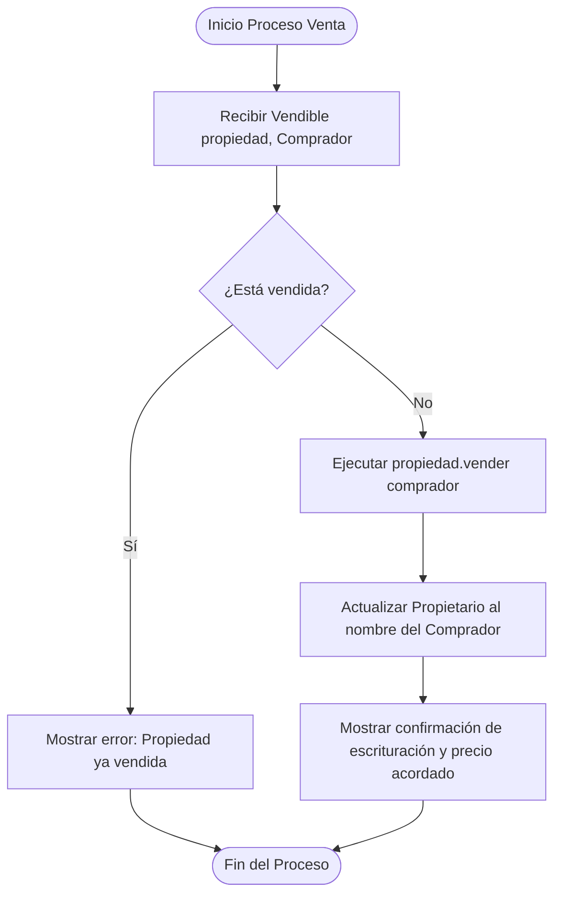

# Trabajo Práctico Nº 3: Principio de Sustitución de Liskov (LSP)

### Integrantes
* **Berrios Juan Cruz**
* **Puerta Candela**

---

## 1. Análisis del Principio SOLID: LSP

El **Principio de Sustitución de Liskov (LSP)** es uno de los cinco principios fundamentales de SOLID y establece que:
> *Si $S$ es un subtipo de $T$, entonces los objetos de tipo $T$ en un programa pueden ser reemplazados por objetos de tipo $S$ sin alterar ninguna de las propiedades deseables de ese programa (correcto, rendimiento, etc.).*

En términos simples: una clase derivada debe ser completamente extensible y compatible con la clase base de la cual hereda, sin que los clientes de la clase base deban preocuparse por comportamientos inesperados o excepciones del tipo "operación no soportada".

### El Problema en el Sistema Inmobiliario (Violación de LSP)
En el rubro de gestión inmobiliaria, existen propiedades con distintos fines comerciales: algunas son para **alquiler**, otras para **venta**, y otras pueden estar bajo ambas modalidades (**mixta** o alquiler con opción a compra).

Si diseñamos el sistema con una jerarquía de herencia tradicional incorrecta:
1. Creamos una clase base `Propiedad` con métodos como `getPrecioAlquiler()`, `alquilar()`, `getPrecioVenta()`, `vender()`.
2. Creamos la clase `PropiedadVenta` que hereda de `Propiedad`. Como una propiedad de venta exclusiva no puede ser alquilada, el programador se ve obligado a hacer lo siguiente:
   ```java
   @Override
   public void alquilar(String inquilino) {
       throw new UnsupportedOperationException("No se alquila");
   }
   ```
3. Esto viola el principio LSP porque si el cliente (`ProcesadorTransacciones` o cualquier controlador de negocio) tiene una lista de objetos `Propiedad` e intenta alquilarlos a todos, el programa fallará catastróficamente en tiempo de ejecución. El cliente no puede sustituir libremente `Propiedad` por `PropiedadVenta`.

### La Solución Aplicada (Cumplimiento de LSP)
Para cumplir con LSP, reestructuramos la jerarquía separando los comportamientos específicos de negocio en **interfaces de comportamiento**:
* **`Propiedad`** (Clase abstracta): Contiene únicamente los datos compartidos de cualquier inmueble (ID, dirección, superficie, propietario original).
* **`Alquilable`** (Interfaz): Define los comportamientos de cobro, contratos y estados propios de un alquiler.
* **`Vendible`** (Interfaz): Define los comportamientos de precio final, traspaso de propiedad y escrituración de venta.

De esta forma, las especializaciones concretas se definen como:
* `PropiedadAlquiler` hereda de `Propiedad` e implementa `Alquilable`.
* `PropiedadVenta` hereda de `Propiedad` e implementa `Vendible`.
* `PropiedadAlquilerVenta` (caso mixto) hereda de `Propiedad` e implementa ambas interfaces.

El cliente (nuestro `ProcesadorTransacciones`) interactúa directamente con las abstracciones (`Alquilable` o `Vendible`). Es imposible intentar alquilar un inmueble que no sea alquilable porque el compilador de Java lo impedirá, evitando errores en tiempo de ejecución.

---

## 2. Diagrama de Clases (UML)

A continuación, se detalla el diagrama de clases del paquete `tp3`, mostrando la separación de interfaces y el cumplimiento del principio LSP:



---

## 3. Modelo de Base de Datos Relacional

Para guardar persistentemente la información de este modelo sin perder la estructura polimórfica ni violar restricciones relacionales, se implementó el patrón de diseño de base de datos **Class Table Inheritance (Tabla por Tipo de Entidad)**.

### Script SQL (DDL)
```sql
CREATE DATABASE IF NOT EXISTS gestion_inmobiliaria;
USE gestion_inmobiliaria;

-- 1. Tabla Propietarios (Dueños)
CREATE TABLE propietarios (
    id_propietario INT AUTO_INCREMENT PRIMARY KEY,
    nombre VARCHAR(100) NOT NULL,
    telefono VARCHAR(20),
    email VARCHAR(100) UNIQUE NOT NULL
);

-- 2. Tabla Clientes (Inquilinos y Compradores)
CREATE TABLE clientes (
    id_cliente INT AUTO_INCREMENT PRIMARY KEY,
    nombre VARCHAR(100) NOT NULL,
    telefono VARCHAR(20),
    email VARCHAR(100) UNIQUE NOT NULL
);

-- 3. Tabla Base: Propiedades
-- Guarda los datos comunes de cualquier propiedad
CREATE TABLE propiedades (
    id_propiedad INT AUTO_INCREMENT PRIMARY KEY,
    direccion VARCHAR(255) NOT NULL,
    superficie DOUBLE NOT NULL,
    id_propietario INT NOT NULL,
    FOREIGN KEY (id_propietario) REFERENCES propietarios(id_propietario) 
        ON DELETE CASCADE ON UPDATE CASCADE
);

-- 4. Tabla de Especialización: Propiedades en Alquiler
-- Relación 1:1 con la tabla propiedades (Especialización)
CREATE TABLE propiedades_alquiler (
    id_propiedad INT PRIMARY KEY,
    precio_alquiler DECIMAL(12, 2) NOT NULL,
    esta_alquilada BOOLEAN DEFAULT FALSE,
    id_inquilino_actual INT DEFAULT NULL,
    FOREIGN KEY (id_propiedad) REFERENCES propiedades(id_propiedad) 
        ON DELETE CASCADE ON UPDATE CASCADE,
    FOREIGN KEY (id_inquilino_actual) REFERENCES clientes(id_cliente)
);

-- 5. Tabla de Especialización: Propiedades en Venta
-- Relación 1:1 con la tabla propiedades (Especialización)
CREATE TABLE propiedades_venta (
    id_propiedad INT PRIMARY KEY,
    precio_venta DECIMAL(12, 2) NOT NULL,
    esta_vendida BOOLEAN DEFAULT FALSE,
    id_comprador INT DEFAULT NULL,
    FOREIGN KEY (id_propiedad) REFERENCES propiedades(id_propiedad) 
        ON DELETE CASCADE ON UPDATE CASCADE,
    FOREIGN KEY (id_comprador) REFERENCES clientes(id_cliente)
);

-- 6. Historial de Contratos de Alquiler
CREATE TABLE contratos_alquiler (
    id_contrato INT AUTO_INCREMENT PRIMARY KEY,
    id_propiedad INT NOT NULL,
    id_inquilino INT NOT NULL,
    fecha_inicio DATE NOT NULL,
    duracion_meses INT NOT NULL,
    monto_mensual DECIMAL(12,2) NOT NULL,
    FOREIGN KEY (id_propiedad) REFERENCES propiedades_alquiler(id_propiedad),
    FOREIGN KEY (id_inquilino) REFERENCES clientes(id_cliente)
);

-- 7. Historial de Transacciones de Venta
CREATE TABLE transacciones_venta (
    id_transaccion INT AUTO_INCREMENT PRIMARY KEY,
    id_propiedad INT NOT NULL,
    id_comprador INT NOT NULL,
    fecha_venta TIMESTAMP DEFAULT CURRENT_TIMESTAMP,
    monto_final DECIMAL(12,2) NOT NULL,
    FOREIGN KEY (id_propiedad) REFERENCES propiedades_venta(id_propiedad),
    FOREIGN KEY (id_comprador) REFERENCES clientes(id_cliente)
);
```

---

## 4. Diagrama Entidad-Relación (MER)

El modelo relacional propuesto se puede visualizar a través del siguiente diagrama físico:



---

## 5. Diagramas de Flujo de Procesos (Flowcharts)

Estos diagramas representan la lógica del negocio de cómo se procesan de manera segura los alquileres y ventas a través de sus respectivas interfaces sin causar fallos imprevistos en tiempo de ejecución.

### 5.1 Flujo del Proceso de Alquiler


### 5.2 Flujo del Proceso de Venta


---

## 6. Conclusión de la Implementación del Principio LSP

La incorporación del Principio de Sustitución de Liskov garantiza la estabilidad del sistema a largo plazo. Al restringir las operaciones que los clientes pueden realizar sobre los objetos (mediante interfaces específicas como `Alquilable` y `Vendible`), evitamos que las clases tengan que falsear comportamientos o lanzar excepciones inesperadas ante la invocación de métodos que no corresponden a su naturaleza. 

*   **En la Base de Datos:** Se replica el mismo principio con la herencia por tablas (`propiedades_alquiler` y `propiedades_venta` extienden a `propiedades` a través de relaciones de clave foránea 1:1), manteniendo la coherencia formal y evitando redundancias.
*   **En el Código:** El programador cliente (`ProcesadorTransacciones`) opera de manera puramente polimórfica sin preocuparse de si se trata de un dúplex mixto, un departamento de alquiler o una casa en venta. La seguridad es controlada en tiempo de compilación.
